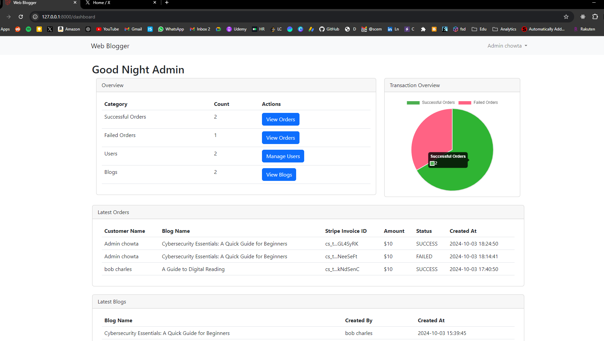
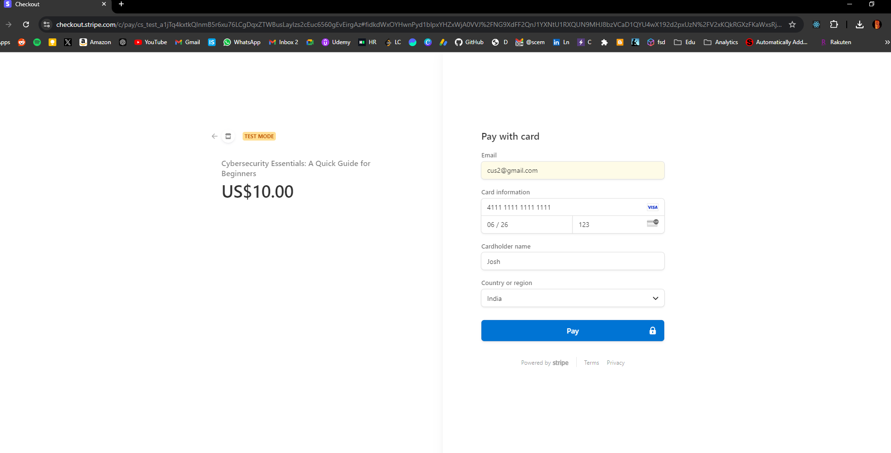
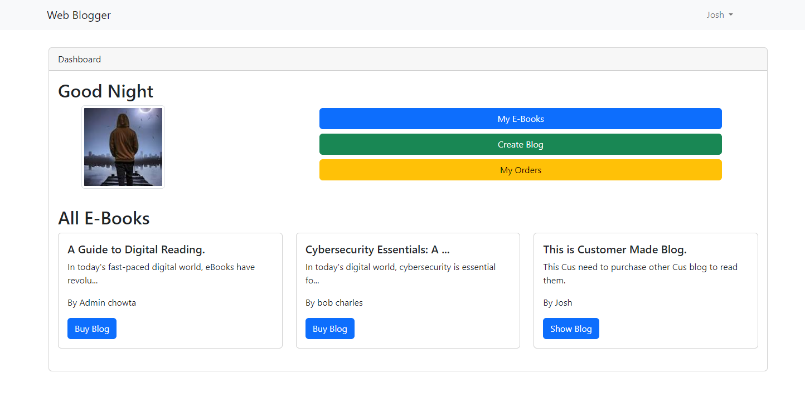
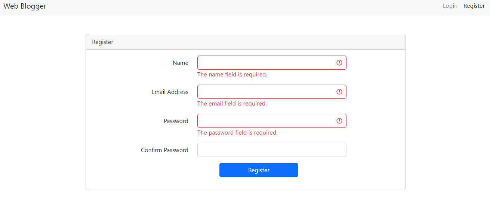

# Web Blogger: Online E-Blog/Book Website

## Task for S Squad Global PHP Developer
This website is built using Laravel (PHP) and MongoDB (NoSQL Database).

### Requirements Given:
1. Login page and customer registration
2. Add a purchase order for the customer
3. Add an invoice for the purchase order (PO)
4. Update payment status
5. Display all details on a dashboard

### Output:
Here are some key snapshots of the website developed:

- **Admin Dashboard Panel**  
  

- **Stripe Integrated Checkout Panel**  
  

- **Customer Home Page View**  
  

- **Customer Registration**  
  
